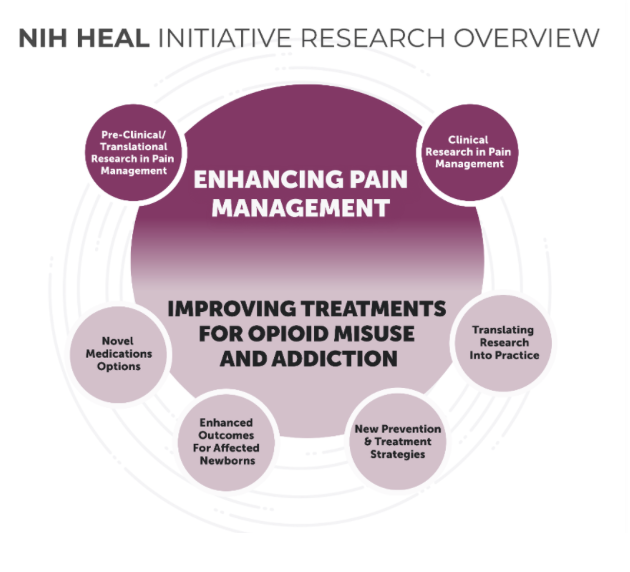

# Automating HEAL Grant Data Characteristics using NLP/ML
- HEAL seeks to improve both pain management and prevention tactics for opioid use disorder.
- Automating classification of HEAL awards for portfolio analysis will:
  - Significantly reduce the time burden of portfolio analysts within HEAL.
  - Highlight research themes, connect investigators studying aligned targets and interventions and determine promising areas for allocating research support.

Set up and activate the conda environment by running the following lines:
```
conda env create -f new_environment_1.yml
conda activate new_environment_1
```
### Structure of repo

- `RCDC` - includes all RCDC files of term sets we used from them.
- `project_info` - includes slide deck of the project. 
- `results/` - all results and figures are saved here.  Information about these folders are contained in their readmes. 
- `src/` - all coding files are saved here. Instructions to run the files to replicate results are contained in code commentation. Methods included rule-based Natural Language Processing approaches, as well as supervised Machine Learning text classification models ex. Random Forest, K-Nearest Neighbors, Support Vector Machine, Logistic Regression. The `README.md` file inside this folder contains detailed description of the work done and the limitations thus far.
- `term_sets/` - includes all the term sets we are currently leveraging and words we discovered using unsupervised learning methods. 
- **I couldn't push the data to the repo due to security reasons, but a lot of my argparse functions refer to the file paths I stored it in on my local drive. I had an `original_data` folder, as well as a `cleaned_data` folder for my data.

### Learn more about HEAL's mission at their [website:](https://heal.nih.gov/about)

